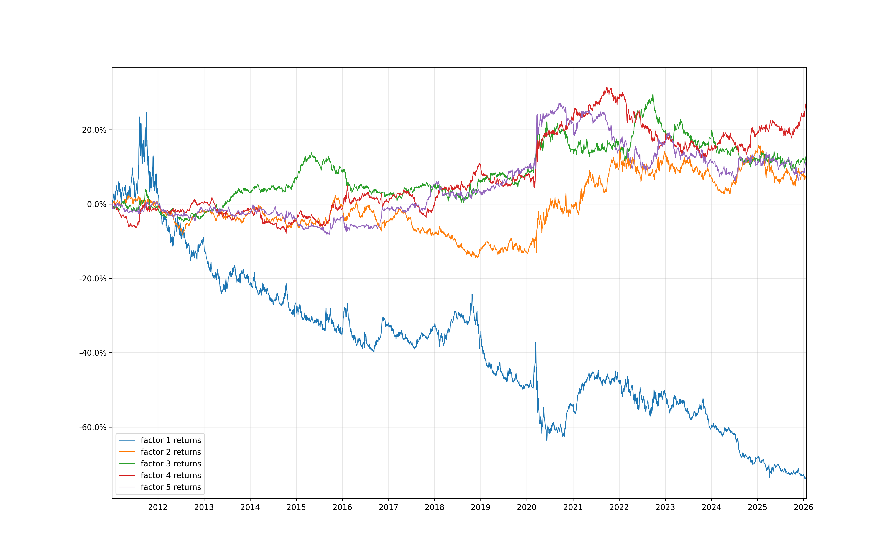
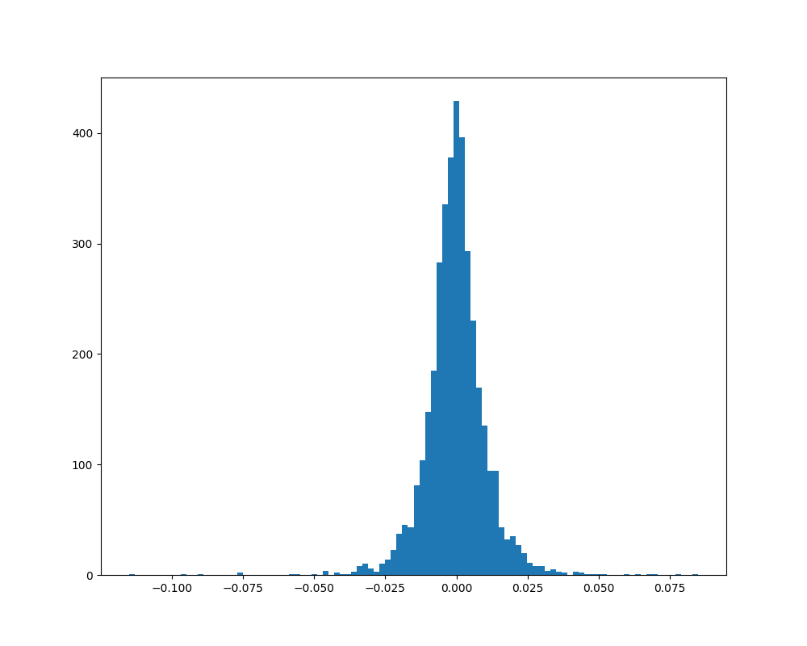

## Statistical Factor Model

This is full implementation of a statistical factor model. It was inspired by Gappy's Chapter 7 of EQI and the toraniko multi-factor model implementation.

The implementation follows a process to ensure the factors are stable over time:

- Two stage PCA is used to first estimate the idiosyncratic volatility of each asset so that assets with higher idio volatility don't dominate the factors. A second PCA is then performed on the standardized returns.
- Eigenvalues are shrunk to pull extreme values towards a mean.
- After the factors are identified weighted least squares regression is used to determine the factor returns.
- Logic is included to lign signs and rotate loadings which minimizes unnecessary turnover to ensure each factor is consistent.

The only data required to run this is symbol-by-symbol daily asset returns. In my case I'm using the current Russell 1000 constituents.
```
┌────────────┬────────┬───────────────┐
│ date       ┆ symbol ┆ asset_returns │
│ ---        ┆ ---    ┆ ---           │
│ date       ┆ str    ┆ f64           │
╞════════════╪════════╪═══════════════╡
│ 2010-01-05 ┆ A      ┆ -0.010863     │
│ 2010-01-05 ┆ AA     ┆ -0.031231     │
│ 2010-01-05 ┆ AAL    ┆ 0.113208      │
│ 2010-01-05 ┆ AAON   ┆ -0.029015     │
│ 2010-01-05 ┆ AAPL   ┆ 0.001729      │
│ …          ┆ …      ┆ …             │
│ 2026-01-23 ┆ ZG     ┆ -0.008977     │
│ 2026-01-23 ┆ ZION   ┆ -0.031951     │
│ 2026-01-23 ┆ ZM     ┆ 0.013349      │
│ 2026-01-23 ┆ ZS     ┆ 0.006289      │
│ 2026-01-23 ┆ ZTS    ┆ -0.002813     │
└────────────┴────────┴───────────────┘
```

The model outputs three dataframes:
1. Loadings
2. Factor Returns
3. Residual Returns

Returns of the first three computed factors:


Histogram of first factor returns: 
